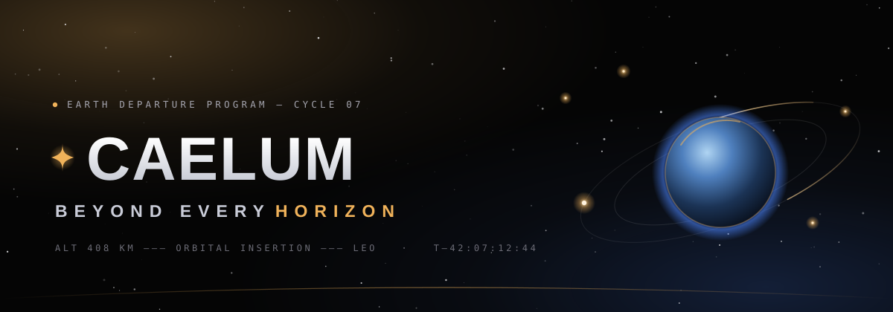

<div align="center">



<br/>

<h1>✦ CAELUM</h1>

<p><strong>Beyond Every Horizon.</strong><br/>
An immersive, scroll-driven space-exploration landing page — from Earth departure to the Galilean moons.</p>

<p>
  
  
  
  
  
  <a href="https://www.kryoncode.xyz"></a>
</p>

</div>

---

## ✦ Overview

**Caelum** is a fictional deep-space exploration company — *"We build the vessels, stations and signal networks that carry humanity past the edge of the map, and bring it back."*

This repository holds the **landing-page prototype**: a single, self-contained page that plays like a cinematic mission briefing. A live WebGL starfield sits behind buttery smooth-scroll, and every section is choreographed with scroll-triggered motion — a launch countdown, a fleet reveal, a draggable orbit, and a signal-network map stretching to the Galilean moons.

It is a **design + front-end craft piece**: no framework app, no build step — just a hand-tuned document that runs straight in the browser.

---

## ✦ Features

- 🌌 **WebGL starfield** — a depth-parallaxed particle field rendered with **Three.js**, drifting behind the entire page.
- 🪐 **Draggable orbit** — *"drag to take the helm"* — an interactive orbital system you can throw and let settle.
- 🛰️ **Signal-network map** — five installations holding the lattice open, from the ground to the Galilean moons.
- ⏱️ **Live launch countdown** — a real ticking `T–` clock to the next window (VELA-9 · Europa Relay · LC-39A).
- 🎞️ **Scroll choreography** — headlines, cards and telemetry reveal in sequence via **GSAP + ScrollTrigger**.
- 🧭 **Buttery smooth scroll** — inertial scrolling powered by **Lenis**.
- 🧲 **Magnetic buttons, 3D tilt cards, custom cursor glow** — tactile micro-interactions throughout.
- 🎛️ **Animated nebulae & telemetry grid** — living background gradients and a slow-drifting grid.
- 📱 **Responsive & glassmorphic** — a floating blurred nav and fluid `clamp()`-based type that scales from phone to widescreen.

---

## ✦ The Journey

The page is one continuous flight, told across nine screens:

| # | Section | Beat |
|---|---------|------|
| `01` | **Hero** | *Beyond Every Horizon* — live launch countdown & GO-FOR-LAUNCH telemetry |
| `02` | **Mission** | *Engineered twice over — once for the void, once for the people inside* |
| `03` | **Systems** | The engineering backbone that makes departure possible |
| `—` | **Film** | An invitation to *watch the film* |
| `◦` | **Observatory / Orbit** | *Drag to take the helm* — the interactive orbital system |
| `04` | **Fleet** | *Built to leave* — the vessels of the program |
| `05` | **Network** | *One signal* — five installations to the Galilean moons |
| `06` | **Record** | The mission record and milestones |
| `07` | **Crew** | *Forty thousand engineers, pilots, students and stubborn optimists* |
| `08` | **CTA** | *Join* the Earth Departure Program |
| `09` | **Footer** | Sign-off and links |

---

## ✦ Tech Stack

| Layer | Tooling |
|-------|---------|
| **3D / WebGL** | [Three.js](https://threejs.org/) `r128` — starfield & orbital scene |
| **Animation** | [GSAP](https://gsap.com/) `3.12.5` + **ScrollTrigger** — scroll-linked motion |
| **Smooth scroll** | [Lenis](https://github.com/darkroomengineering/lenis) `1.1.14` |
| **Type** | [Clash Display](https://www.fontshare.com/fonts/clash-display) + [Satoshi](https://www.fontshare.com/fonts/satoshi) (Fontshare) · [IBM Plex Mono](https://fonts.google.com/specimen/IBM+Plex+Mono) |
| **Runtime** | `support.js` — a lightweight document runtime that hydrates the `.dc.html` template |
| **Build** | None. Static HTML + CDN libraries. |

---

## ✦ Design System

A dark, mission-control palette — near-black canvas, cool periwinkle signal accent, a whisper of nebula violet.

| Swatch | Token | Hex | Role |
|:------:|-------|-----|------|
|  | Void | `#050505` | Page canvas |
|  | Ink | `#EDEDF0` | Primary text |
|  | Accent | `#5B7CFF` | Signal / links / glow |
|  | Nebula | `#8B5CF6` | Secondary atmosphere |
|  | Dim | `#A5A5AF` | Supporting copy |
|  | Faint | `#6C6C76` | Telemetry / labels |

**Type:** Clash Display for display headlines · Satoshi for body · IBM Plex Mono for eyebrows, labels and telemetry.

---

## ✦ Getting Started

No install, no build. Clone and open.

```bash
git clone https://github.com/ryhnxyz/caelum-space.git
cd caelum-space
```

**Quickest** — open the file directly in a modern browser:

```bash
open "caelum-landing.dc.html"      # macOS
xdg-open "caelum-landing.dc.html"  # Linux
start "caelum-landing.dc.html"     # Windows
```

**Recommended** — serve the folder (a couple of interactions behave best over `http://`):

```bash
npx serve .
# then open the printed http://localhost:… URL
```

> **Note** — keep `support.js` next to `caelum-landing.dc.html`; the page loads it relatively. Three.js, GSAP and Lenis load from CDN, so an internet connection is needed on first paint.

---

## ✦ Project Structure

```text
caelum-space/
├─ caelum-landing.dc.html   # the page — markup, styles & scene logic
├─ support.js               # document runtime that hydrates the template
├─ assets/
│  └─ banner.svg            # the hero banner in this README
└─ README.md
```

---

## ✦ Roadmap

- [ ] Ship it live on GitHub Pages
- [ ] Self-host fonts & libraries for full offline / no-CDN loading
- [ ] A `prefers-reduced-motion` low-motion mode
- [ ] Lighthouse & performance pass

---

## ✦ Credits

Designed & built by **[KryptonCode](https://www.kryoncode.xyz)**.

<div align="center">
<br/>

**✦ CAELUM** — *Beyond Every Horizon*

[](https://www.kryoncode.xyz)

<sub>Crafted by KryptonCode · www.kryoncode.xyz</sub>

</div>
